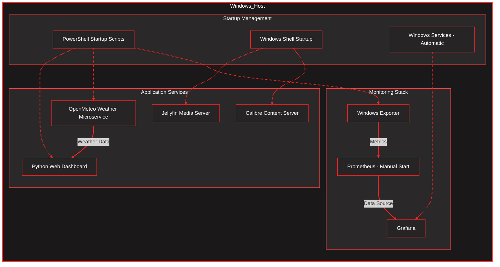

```mermaid
graph TB

    subgraph Windows_Host
        direction TB
        
        subgraph Startup["Startup Management"]
            B7[PowerShell Startup Scripts]
            B8[Windows Shell Startup]
            B11[Windows Services - Automatic]
        end
        
        subgraph Monitoring["Monitoring Stack"]
            B1[Prometheus - Manual Start]
            B2[Grafana]
            B6[Windows Exporter]
        end
        
        subgraph Services["Application Services"]
            B5[OpenMeteo Weather Microservice]
            B4[Python Web Dashboard]
            B9[Jellyfin Media Server]
            B10[Calibre Content Server]
        end
    end

    %% Startup Dependencies
    B7 -.-> B4
    B7 -.-> B5
    B7 -.-> B6
    B8 -.-> B9
    B8 -.-> B10
    B11 -.-> B2

    %% Monitoring Flow
    B6 -->|Metrics| B1
    B1 -->|Data Source| B2

    %% Service Integration
    B5 -->|Weather Data| B4

    %% Styling
    style Windows_Host fill:#1a1818,stroke:#f72525,stroke-width:2px,color:#ffffff
    style Startup fill:#2a2828,stroke:#ff4444,stroke-width:1.5px,color:#ffffff
    style Monitoring fill:#2a2828,stroke:#ff4444,stroke-width:1.5px,color:#ffffff
    style Services fill:#2a2828,stroke:#ff4444,stroke-width:1.5px,color:#ffffff
    
    style B1 fill:#262424,stroke:#f72525,stroke-width:1.5px,color:#ffffff
    style B2 fill:#262424,stroke:#f72525,stroke-width:1.5px,color:#ffffff
    style B4 fill:#262424,stroke:#f72525,stroke-width:1.5px,color:#ffffff
    style B5 fill:#262424,stroke:#f72525,stroke-width:1.5px,color:#ffffff
    style B6 fill:#262424,stroke:#f72525,stroke-width:1.5px,color:#ffffff
    style B7 fill:#262424,stroke:#f72525,stroke-width:1.5px,color:#ffffff
    style B8 fill:#262424,stroke:#f72525,stroke-width:1.5px,color:#ffffff
    style B9 fill:#262424,stroke:#f72525,stroke-width:1.5px,color:#ffffff
    style B10 fill:#262424,stroke:#f72525,stroke-width:1.5px,color:#ffffff
    style B11 fill:#262424,stroke:#f72525,stroke-width:1.5px,color:#ffffff

    linkStyle default stroke:#f72525,stroke-width:2.5px
```